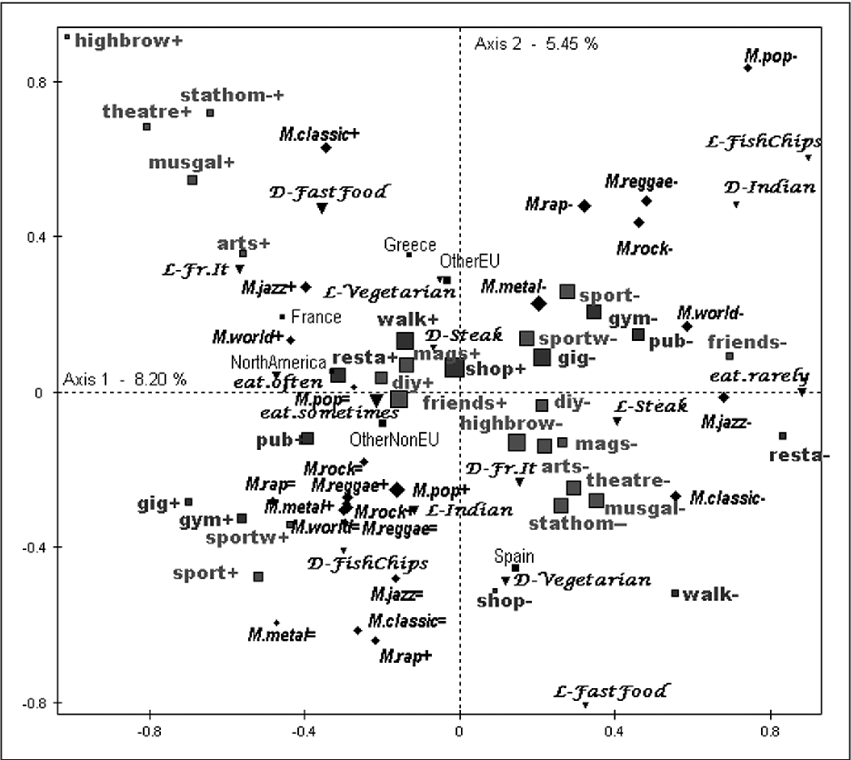

<div class="row">
<div class="col-sm-6">

In this course I try to show how to collect survey data, as well as how to analyse them. We try to consider two main aspects of the concept of **measure**: the first one is when you collect the **measure**, the second one is when you analyse it. The measure, in other words the way you want to differentiate your respondents, has to be properly constructed and has to be in accordance with the research question of interest. Not to mention that the research question is just only an expression of a problem, an issue.

</div>
<div class="col-sm-6">

```{r MCAIllu, out.width=350, echo=F,fig.cap="A New Model of Social Class? Findings from the BBC’s Great British Class Survey Experiment (M. Savage et al.)",fig.align='center'}

```

</div>
</div>